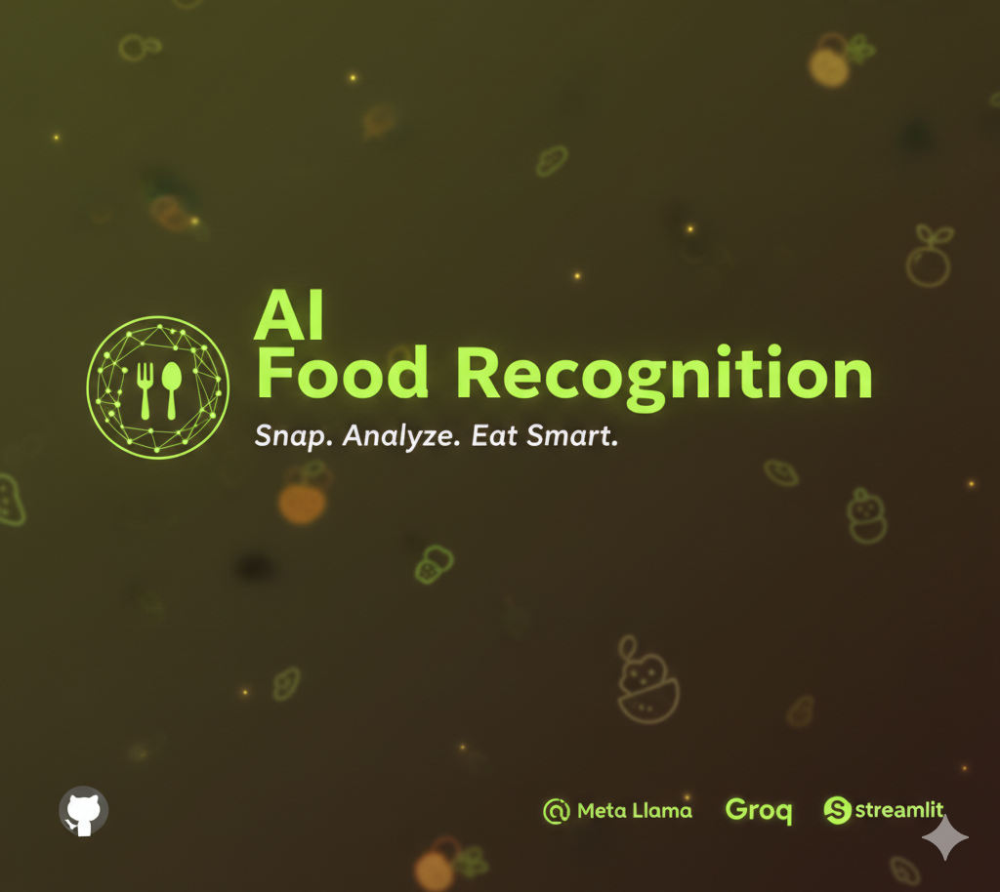

# 🍔 AI Food Recognition & Calorie Counter


<div align="center">
  
</div>

An intelligent application that uses computer vision and Large Language Models (LLMs) to analyze food images, estimate calories, calculate macros, and provide health tips. Built with Streamlit and powered by Groq's high-speed inference API.

## ✨ Features

- **📸 Instant Food Recognition**: Identify food items from uploaded images.
- **🔢 Calorie Estimation**: Get approximate calorie counts for your meal.
- **📊 Macro Analysis**: Detailed breakdown of Proteins, Carbs, and Fats.
- **📉 Interactive Visualizations**:
    - **Pie Chart**: Visual distribution of macros.
    - **Bar Chart**: Gram-based nutritional comparison.
- **🥗 Health Tips**: Personalized advice based on the analyzed food.
- **⚡ High-Speed Inference**: Powered by Groq's `llama-4-scout` multimodal model.

## 🚀 Getting Started

### Prerequisites

- Python 3.10 or higher
- A [Groq API Key](https://console.groq.com/keys)

### Installation

1.  **Clone the repository**
    ```bash
    git clone <repository-url>
    cd End-To-End-Gemini-Project
    ```

2.  **Install Dependencies**
    ```bash
    pip install -r requirements.txt
    ```

3.  **Configure Environment**
    Create a `.env` file in the root directory and add your Groq API key:
    ```env
    GROQ_API_KEY=gsk_your_groq_api_key_here
    ```

### Usage

Run the main application using Streamlit:

```bash
streamlit run food_recognition.py
```

Or run the Chat Vision demo:

```bash
streamlit run vision.py
```

## 🛠️ Tech Stack

- **Frontend**: [Streamlit](https://streamlit.io/)
- **AI Model**: [Groq](https://groq.com/) (Meta Llama 4 Scout Vision)
- **Data Visualization**: [Plotly](https://plotly.com/)
- **Image Processing**: Pillow (PIL)

## 📂 Project Structure

- `food_recognition.py`: Main application with calorie counting and visualizations.
- `vision.py`: Simple Q&A chatbot for image analysis.
- `requirements.txt`: Python package dependencies.
- `.env`: Configuration file for API keys.

## ⚠️ Note

This application allows you to estimate nutritional content but should not be considered as medical advice. Calorie counts are estimates generated by AI.

---
*Created for the Advanced Agentic Coding Project*